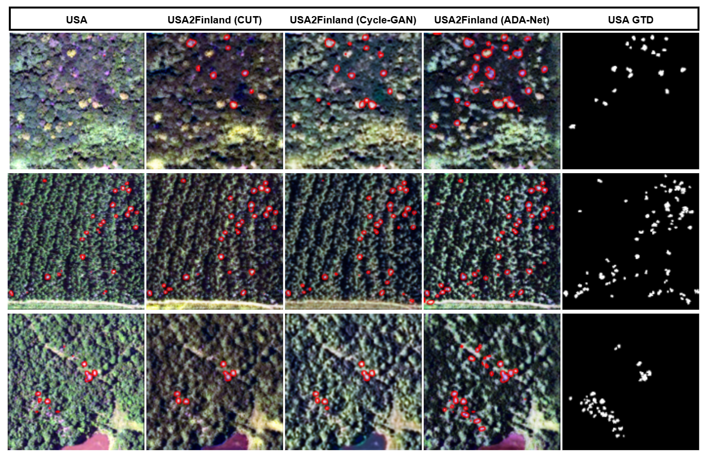

Attention-Guided Domain Adaptation Network (ADA-Net)
=============================

This repository shares the implementation of [ADA-Net: Attention-Guided Domain Adaptation Network with Contrastive Learning for Standing Dead Tree Segmentation Using Aerial Imagery](https://arxiv.org/abs/2504.04271) and includes the annotated dataset for mapping standing dead trees. ADA-Nets are generic networks and they can be used in different domation adaptation and Image-to-Image translation problems. In this repository, we specifically focus on transforming multispectral remote sensing aerial images from USA sites into images resembling those from Finland. The tree annotations are provided at the individual tree level.

<p align="center">

</p>
<p align="center">
<em>Dead tree segmentation results are given for both the original images and the generated ones obtained through different domain transformation approaches. The pretrained segmentation network is trained using images from Finland sites.</em>
</p>

Content:
- [Citation](#citation)
- [Software Environment](#software-environment)
- [Downloading the Dataset](#downloading-the-dataset)
- [Kaggle Dataset](#kaggle-dataset)
- [Training](#training)
- [Testing](#testing)
- [Custom Dataset Training Guide](#custom-dataset-training-guide)
- [References](#references)

## Citation

If you use method(s) and the dataset(s) provided in this repository, please cite the following paper:

M. Ahishali, A. U. Rahman, E. Heinaro, and S. Junttila, "ADA-Net: Attention-Guided Domain Adaptation Network with Contrastive Learning for Standing Dead Tree Segmentation Using Aerial Imagery," _arXiv preprint arXiv:2504.04271_, 2025.

```
@misc{ahishali2025adanet,
      title={ADA-Net: Attention-Guided Domain Adaptation Network with Contrastive Learning for Standing Dead Tree Segmentation Using Aerial Imagery}, 
      author={Mete Ahishali and Anis Ur Rahman and Einari Heinaro and Samuli Junttila},
      year={2025},
      eprint={2504.04271},
      archivePrefix={arXiv},
      primaryClass={cs.CV},
      url={https://arxiv.org/abs/2504.04271}, 
}
```

## Software Environment:

```
git clone https://github.com/meteahishali/ADA-Net.git
cd ADA-Net/
```
Pip based installation:
```
python -m venv my_env/
source my_env/bin/activate
pip install --upgrade pip
pip install -r requirements.txt
```

Conda based environment:
```
conda env create -f environment.yml
conda activate ada_net
```

Finnish supercomputers [Puhti and Mahti](https://csc.fi/en/our-expertise/high-performance-computing/supercomputers-mahti-and-puhti/):
```
source create_pytorch_env.sh my_env/ requirements.txt
```

Note for [Lumi](https://lumi-supercomputer.eu/), include ```module use /appl/local/csc/modulefiles/``` in ```create_pytorch_env.sh```.

## Downloading the Dataset

We collect the dataset consisting of unpaired aerial multispectral image samples from the US [1] and Finland [2]. The image samples have four-band data including near-infrared channel (NIR) and RGB channels. The preprocessed dataset is shared in ```.h5``` format and can be downloaded [here](https://drive.google.com/file/d/1ISULgGGGBISN6ygT9rqgGqssMHU8NZOU/view?usp=sharing), please download the files and unzip it:

```
unzip dataset.zip
```

These datasets also consist of polygon annotations for standing dead trees annotated by our collaborator group of forest health experts. Note that we share only a small sub-set of the Finland data due to the extensive size of the whole annotated regions and the aerial imagery data.

## Kaggle Dataset

Although we already provide direct ```.h5``` files for the pre-processed data above, the full dataset with untiled image frames are available in the following Kaggle repository: https://www.kaggle.com/datasets/meteahishali/aerial-imagery-for-standing-dead-tree-segmentation. We share the RGB and NRG images in ```.png``` format together with the corresponding ground-truth mask images for the USA data.

## Training

The proposed ADA-Net method can be trained as follows,

```
python train.py
```

Configurations for training are available and can be adjusted in ```configs/adanet.txt```. During the training, the RGB and false color NRG views (NIR-R-G) of the generated multispectral data are saved for the training set.

## Testing

The evaluation of the method over the test data can be performed using the provided ```test.py``` script as follows,

```
python test.py
```

Checkpoints of ```'latest'``` are loaded in testing. You can specify another epoch number by changing ```resume-epoch``` setting in ```configs/adanet.txt```. Optionally you can set ```visualize = False``` in the test script if you want store only output ```.h5``` files, otherwise RGB view generated images are saved as well.

## Custom Dataset Training Guide

If you want to train using your own images, start by specifying the extension format indicated as ```dataset-type``` in ```configs/adanet.txt```. Then, the data should be organized in ```trainA```, ```trainB```, ```testA```,  and ```testB``` folders under ```data/``` or modify ```data-folder-A``` and ```data-folder-B``` as needed in ```configs/adanet.txt```. For instance, let's run ADA-Net model on the horse2zebras dataset:

```
wget https://github.com/akanametov/cyclegan/releases/download/1.0/horse2zebra.zip
unzip horse2zebra.zip
mv -f horse2zebra/* data
```

Next, ```configs/adanet.txt``` should be modified accordingly by setting ```dataset-type = jpg```. You may adjust ```learning-rate = 2e-4``` or ```2e-5``` depending on your problem. It is advisible to change the number of epochs to 200, e.g., ```initial-epochs = 100``` and ```decay-epochs = 100```. Additionally, assuming you are using RGB images not multispectral data, please change ```input-channels = 3``` and ```output-channels = 3``` to align with the typical three-channel data size.

Note that the current data augmentation is most suitable for the remote sensing data. It includes some domain-specific augmentations such as multiplitative noise. Therefore, it is suggusted to modify ```treemort/augment.py``` script to suit your dataset. For now, in ```configs/adanet.txt```set ```train-load-size = 286``` and```augment-mode='partial'``` to perform only resizing and random cropping as augmentation. Finally, the training can be started using the following script:

```
python train.py
```

## References

[1] "National Agriculture Imagery Program," https://naip-usdaonline.hub.arcgis.com/. \
[2] "National Land Survey of Finland," https://asiointi.maanmittauslaitos.fi/karttapaikka/tiedostopalvelu.